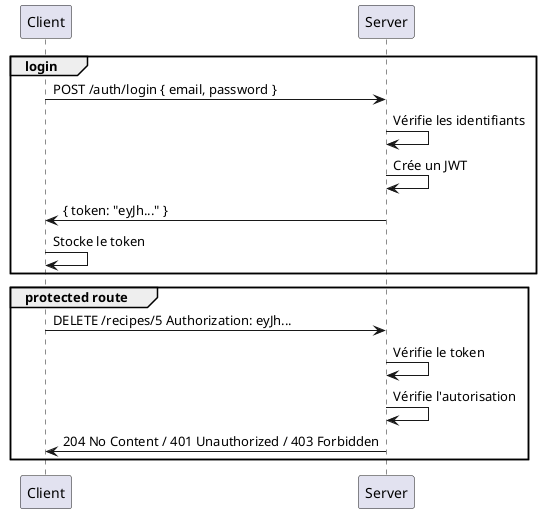

# Web 2 — Séance 03
## Authentification par JWT

---

# Authentification vs Autorisation

**Authentification** : Qui es-tu ? (vérifier l'identité)
- L'utilisateur se connecte avec email + mot de passe
- On valide ses identifiants
- On crée une session / token

**Autorisation** : Que peux-tu faire ? (vérifier les permissions)
- Peut-il accéder à cette recette ?
- Peut-il modifier cette recette ?
- Est-il administrateur ?

---

# Authentification par JWT

- **JWT** = JSON Web Token
- Token = petit bout de texte encodé qui contient des informations sur l'utilisateur
- Représente l'identité de l'utilisateur et ses permissions
- Permet d'identifier l'utilisateur qui fait une action
- L'utilisateur est authentifié tant qu'il possède un token valide
- Le token est envoyé à chaque requête pour prouver l'identité de l'utilisateur

---

# Structure d'un JWT

- Un token est un texte structuré avec 3 parties : `header.payload.signature`

```
eyJhbGciOiJIUzI1NiIsInR5cCI6IkpXVCJ9.
eyJpZCI6MSwiZW1haWwiOiJqb2huQGdtYWlsLmNvbSIsImlhdCI6MTYzNzUxMjAwMH0.
wH_FkWR5qf3nGTr5eH4rJ2k8nL9oP3qR2sT1uV6wX7y
```

- **Header** : type de token et algorithme de signature
- **Payload** : données utilisateur (id, email, etc.)
- **Signature** : preuve d'authenticité

Chaque partie est encodée en Base64 <br>
&rarr; N'importe qui peut décoder le token et voir le contenu <br>
https://jwt.io ou https://www.base64decode.org

---

# Workflow JWT



---

# Générer un JWT

Librairie à utiliser : `jsonwebtoken`

```ts
// npm install jsonwebtoken
import jwt from "jsonwebtoken";

// Clé secrète pour signer le token (à garder confidentielle)
const SECRET_KEY = "votre_clé_secrète_très_longue";

// Informations identifiant l'utilisateur
// Stockées dans le payload du token
interface TokenPayload {
  id: number;
  email: string;
  role: "user" | "admin";
}
```

---

# Générer un JWT (suite)

```ts
function generateToken(user: TokenPayload): string {
  return jwt.sign(
    user,
    SECRET_KEY,
    {
      expiresIn: "1d", // Expire dans 1 jour
      algorithm: "HS256", // algorithme de signature
    }
  );
}

// Exemple d'utilisation
const token = generateToken({
  id: 1,
  email: "john@gmail.com",
  role: "user",
});

console.log(token);
// eyJhbGciOiJIUzI1NiIsInR5cCI6IkpXVCJ9.eyJpZCI6MSwiZW1haWwiOi...
```

---

# Décoder un JWT

Que contient ce token une fois décodé ?

```ts
// Header:
{
  "alg": "HS256",
  "typ": "JWT"
}

// Payload:
{
  "id": 1,
  "email": "john@gmail.com",
  "role": "user",
  "iat": 1637512000, // iat = issued at (quand créé)
  "exp": 1638116800  // exp = expiration time (quand expire)
}
```

---

# Vérifier un JWT

```ts
// Vérifier et décoder
function verifyToken(token: string): TokenPayload | null {
  try {
    const decoded = jwt.verify(token, SECRET_KEY) as TokenPayload;
    return decoded;
  } catch (error) {
    // Token invalide, expiré, etc.
    console.error("Token invalide :", error);
    return null;
  }
}

// Exemple d'utilisation
const token = "eyJhbGc...";
const payload = verifyToken(token);

if (payload) {
  console.log("Utilisateur :", payload.email);
} else {
  console.log("Token rejeté");
}
```

---

# Middleware d'Authentification

Vérifier le token avant d'accéder à une route protégée.

```ts
export class AuthService {
  static authorize(req: Request, res: Response, next: NextFunction) {
    const token = req.get("Authorization");
    if (!token) return res.sendStatus(401);

    const payload = verifyToken(token);

    if (!payload) return res.sendStatus(401);

    req.user = payload;
    next();
  }

  static isAdmin(req: Request, res: Response, next: NextFunction) {
    if (req.user.role !== "admin") return res.sendStatus(403);
    next();
  }
}
```

---

# Routes Protégées

Utiliser le middleware pour protéger les routes.

```ts
export const recipesController = Router();

recipesController.get("/:id", AuthService.authorize, (req: AuthenticatedRequest, res: Response) => {
  const recipeId = parseInt(req.params.id);
  const recipe = RecipesService.getRecipeById(recipeId);
  if (!recipe) return res.sendStatus(404);

  // Vérifier si l'utilisateur a le droit de voir la recette
  if (recipe.userId !== req.user.id && req.user.role !== "admin") {
    return res.sendStatus(403); // Forbidden
  }

  res.json(recipe);
});

recipesController.delete("/:id", AuthService.authorize, AuthService.isAdmin, (req, res) => {
  RecipesService.deleteRecipe(recipeId);
  res.sendStatus(204);
});
```

---

# Route de Login

Vérifie les identifiants et génère un JWT si correct.

```ts
authController.post("/login", (req: Request, res: Response) => {
  const { email, password } = req.body;
  const user = UsersService.findByEmail(email);
  if (!user || user.password !== password) { // pas sécurisé, hachage à voir en séance 04
    return res.sendStatus(401);
  }

  const token = generateToken({
    id: user.id,
    email: user.email,
    role: user.role,
  });

  res.json({ token });
});
```

---

# Stockage d'un JWT dans REST Client

Permet de tester les routes protégées avec un token.

```http
### Login
# @name = login
POST http://localhost:3000/auth/login
Content-Type: application/json

{
  "email": "...",
  "password": "..."
}

### DELETE Recipe
DELETE http://localhost:3000/recipes/5
Authorization: {{login.response.body.token}}
```

---

# Récapitulatif Séance 03

- **Authentification vs Autorisation** — Qui es-tu ? Que peux-tu faire ?

- Qu'est-ce qu'un **JWT** ? — JSON Web Token

- **JWT Structure** — header.payload.signature

- **Générer un JWT** — `jwt.sign()` avec clé secrète

- **Vérifier un JWT** — `jwt.verify()` pour décoder

- **Middleware** — Protéger les routes

- **Route de login** — Vérifier les identifiants et générer un token

**Prochaine séance** : Séance 04 — Hachage et sécurité

---

# Exercice filé S03

1. Modifiez votre backend pour utiliser JWT pour l'authentification
2. Assurez-vous que votre route de login renvoie un token JWT
3. Protégez les routes qui vous semblent nécessaires pour qu'elles nécessitent un token JWT valide
4. Testez vos routes avec REST Client
5. **Optionnel** : Décodez un JWT manuellement sur jwt.io et retrouvez ses claims